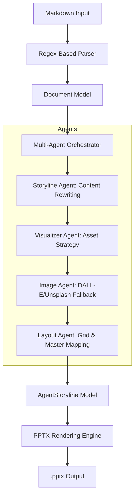

# MD2PPTX: Deep Technical Progress Handout

## 🏗️ System Architecture: The Multi-Agent Orchestration Framework

MD2PPTX is built on a **Modular Multi-Agent Pipeline**. Unlike linear converters, it uses specialized AI agents to make high-level design decisions before a single slide is rendered.

---

## 🔍 Deep Dive: Core Components

### 1. The Parser Engine (`parser.py`)
The parser is far more than a simple text splitter. It uses a **multi-pass regex strategy** to construct a hierarchical `Document` model.
- **Title/Subtitle Heuristics**: Automatically identifies the Document Title from the first H1 and the Subtitle from the first H3 or H2.
- **Section Hierarchies**: Supports nested `Section` objects (H2 -> H3 mapping) to maintain the logical flow of complex documents.
- **Intelligent Table Analysis**: Implemented a `_check_numerical()` post-init hook that uses non-greedy regex to strip symbols ($, %, billion, etc.) and validate cells as floats. This flag triggers the **Chart Candidate** generation later in the pipeline.
- **Reference Scrubbing**: Automatically removes research citations like `[1](url)` to ensure clean slide text while preserving accuracy.

### 2. The Multi-Agent Intelligence (`agents/`)
We have implemented four distinct classes of agents, each with its own Pydantic-validated output model:

| Agent | Responsibility | Technical Mechanism |
| :--- | :--- | :--- |
| **Storyline Agent** | Content Transformation | Uses Gemini-Pro to rewrite long paragraphs into slide-ready bullet points with contextual emojis. |
| **Visualizer Agent** | Strategy Assignment | Analyzes section length and table metadata to decide if a slide needs a **Table**, **Chart**, **Infographic**, or **Hero Image**. |
| **Image Agent** | Visual Sourcing | Features a **Dual-Mode Fallback**: 1. Gemini Image Generation 2. Unsplash API (for corporate/realistic shots) 3. LoremFlickr (safe placeholder). |
| **Layout Agent** | Spatial Mapping | Analyzes the `slide_layouts` of the provided `.pptx` template. It maps content to specific indices (e.g., Layout 0 for Cover, Layout 1 for Detail) based on content density. |

### 3. Dynamic Visual Generation (`charts.py` & `infographics.py`)
- **HSL-Based Theming**: Instead of static palettes, charts are generated using colors extracted dynamically from the Slide Master's theme properties.
- **Native Infographics**: We avoid flat images for process flows. Our engine uses `MSO_SHAPE` (Chevrons, Rectangles, Arrows) to build **editable PowerPoint shapes**. This ensures they remain sharp at any resolution and allow for post-generation manual tweaks.
- **DPI-Aware Charting**: Matplotlib charts are rendered at high resolution (300 DPI) and inserted with exact Emu (English Metric Unit) coordinate matching to avoid stretching.

### 4. The Rendering Engine (`renderer.py`)
The renderer acts as the "Architect" that executes the instructions provided by the Agents.
- **Slide Master Synchronization**: Automatically wipes existing template slides and recreates them from the Master, ensuring 100% compliance with branding.
- **Placeholders vs. Textboxes**: Smart logic prioritizes existing template placeholders (`idx=0` for Title, `idx=10` for Subtitle). If placeholders are missing, it dynamically calculates coordinates from `design.py` constants.
- **Two-Column Balancing**: Automatically calculates midpoint splits for long bullet lists to convert them into balanced two-column layouts.

---

## ✅ Comprehensive Work Log: Milestones Achieved

### Phase 1: Foundational Development
- [x] **Document Object Model (DOM)**: Designed the `Document`, `Section`, and `ContentBlock` classes.
- [x] **Design Tokens**: Standardized `design.py` with PPT-standard dimensions (13.33" x 7.5").
- [x] **CLI Wrapper**: Built a production-ready entry point with `argparse`.

### Phase 2: Agent Integration
- [x] **Orchestrator Pattern**: Implemented the `MultiAgentOrchestrator` to manage agent sequencing.
- [x] **Image Fallback System**: Built a robust visual sourcing pipeline that never fails (Generates → Fetches → Replaces).
- [x] **Layout Logic**: Developed the first version of the automatic Slide Master layout matcher.

### Phase 3: Visual Polish & Performance
- [x] **Themed Plotting**: Connected Matplotlib to our internal design system colors.
- [x] **Shape-Based Visuals**: Completed the process flow and timeline generators.
- [x] **Git Cleanliness**: Performed a deep security audit, cleaned credentials from history, and stabilized the repository.

---

## 🚀 Future Roadmap & Deep Refinements

1.  **Semantic Layout Mapping**: Using LLMs to analyze if a layout's "look" matches the "feel" of the content (e.g., modern vs. formal).
2.  **Vector Icons**: Integrating SVG/EMF icon support for professional iconography beyond standard shapes.
3.  **Speaker Notes Generation**: Creating an additional agent to write actual scripts for presenters in the Slide Notes section.

---
> **Project State**: `STABLE / BETA`
> **Pushed to**: `main` (cleaned and verified)
